# 抓取与叠毛巾 —— 让双臂学会"看、想、动"（SmolVLA 视觉语言动作模型）

> 在之前的卡片里，你已经看过机械臂怎么跟着预设轨迹走。这一讲完全不同：机械臂的每一段动作不再是"人写好的剧本"，而是**模型看着相机画面自己"想"出来的**。本教案带你从模型原理走到真机实操，完成一次完整的 750 步叠毛巾任务。
>
> 你将完成四件事：
> 1. **理解任务编排**：看懂"安全归位 → 750 步执行 → 第 300 步切入混合"的两阶段流程。
> 2. **看懂 SmolVLA 原理**：明白"视觉语言模型 + 动作专家"如何从图像直接生成关节动作。
> 3. **一键启动真机**：用 `run_hybrid_towel_blend750.sh` 跑通一次完整的真机叠毛巾。
> 4. **打开三路相机看真实画面**：在卡片画面面板里看到机械臂左/中/右三个视角的实时画面。
>
> 预计用时：40 分钟。

**先看效果**：下图是本次任务的一段真机演示——机械臂看着三路相机画面，自己完成"抓取 → 折叠 → 归位"：

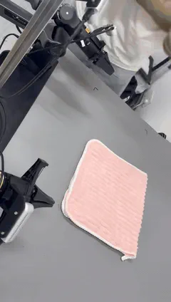

> 👀 **你能做出来的效果**：跑完脚本，机械臂就会像动图里这样，自己把毛巾叠好。

---

## 本讲学习目标

| 维度 | 你将掌握 |
|------|----------|
| 概念认知 | 说出 VLA 是什么、SmolVLA 由什么构成、为什么用动作分块 |
| 原理理解 | 看懂"安全基线 + authority 塑形"如何让 SmolVLA 主导又不会失控 |
| 动手实操 | 跑通一次完整的 750 步真机叠毛巾（`status=0`） |
| 观测画面 | 打开左/中/右三路相机，看到机械臂工作的真实画面 |
| 排查能力 | 能从执行日志判断运行是否正常、失败在哪个环节 |

> 💡 **本讲全程"对照检查"**：每一步你都能用文中截图比对，看到一样的画面就说明你做对了。

---

<div style="page-break-after: always;"></div>

## 1. 任务是什么

本卡片用 **SmolVLA**（视觉-语言-动作模型）驱动双 Piper 机械臂，在毛巾台上完成"抓取 → 折叠 → 归位"的连续任务。整段动作由模型预测、安全机制兜底。

### 1.1 任务流程

```
阶段一 安全归位  →  阶段二 750 步执行  →  第 300 步切入混合  →  第 301–750 步 SmolVLA 主导塑形  →  结束保持姿态
（双臂回起始位）    （30 Hz，约 25 秒）     （authority 从 0 起）      （authority 升至 0.7–0.9）
```

| 阶段 | 内容 | 说明 |
|------|------|------|
| 阶段一 | 双臂安全归位 | 机械臂自动回到起始位，全程无需手动输入 MOVE |
| 阶段二 | 相机检测 + 模型加载 | 脚本自动检测三路相机、加载 SmolVLA 权重 |
| 执行中 | 750 步逐帧执行 | 每步由模型预测 + 安全基线兜底，命令以 30 Hz 下发 |
| 收尾 | 保持姿态 | 任务完成或异常退出时，机械臂保持当前姿态（不会下坠） |

### 1.2 SmolVLA 是什么

**一句话：SmolVLA = 视觉语言模型（SmolVLM2-500M）+ 动作专家头（Action Expert）。**

下图是 SmolVLA 论文首页（*SmolVLA: Smol Models for Vision-Language-Action*）：

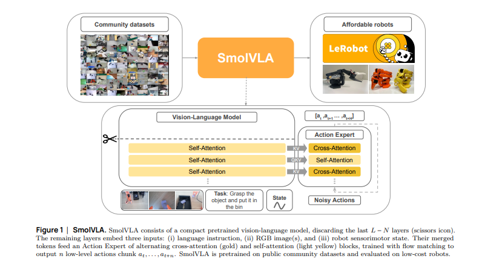

> 💡 **先看结论**：SmolVLA 用"一个 5 亿参数的视觉语言模型当骨干"，学的是"看懂画面 → 直接输出动作"，而不是一帧一帧硬编码。

| | 传统编程 | SmolVLA |
|------|----------|---------|
| 动作来源 | 人手写每一步 | 模型从图像 + 指令预测 |
| 应对变化 | 场景变了就要重写 | 看懂了就能做 |
| 参数规模 | — | 约 500M，单卡可推理 |

机械臂的"工作方式"三步：

1. **看**：读入相机图像，看懂场景里有什么（毛巾、边缘、目标位置）
2. **想**：读懂任务文本（如"把毛巾对折"）与当前关节状态
3. **动**：直接输出一段关节动作序列

**整体架构示意**（三路图像 + 任务文本 + 关节状态 → 视觉语言骨干 → 动作专家头 → 关节动作）：

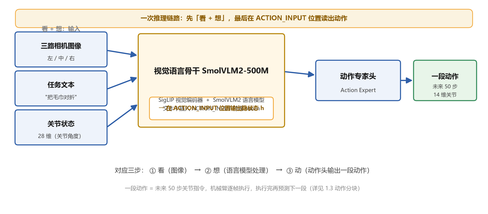

### 1.3 原理：动作分块与两阶段训练

**关键机制 1 —— `ACTION_INPUT` 特殊 token**

1. 输入文本里插入一个占位 token `ACTION_INPUT`
2. 骨干模型处理到这个 token 的位置时，输出一组隐状态
3. 动作专家头把这组隐状态映射成**一段动作序列**

**关键机制 2 —— 动作分块（Action Chunking）**

模型不是逐帧预测动作，而是**一次预测未来 50 步的动作块**：

- 减少逐帧预测的累积误差，动作更平滑
- 推理时生成一块 → 机械臂执行 → 再生成下一块，循环推进

**两阶段训练**

| 阶段 | 训练方式 | 对应权重 |
|------|----------|----------|
| Stage A（掩码预训练） | 遮盖部分动作块，让模型从"视觉 + 文本"猜被遮的动作，学习视觉-动作对齐 | `smolvla_base → stageA → stageA_480 → stageA_add` |
| Stage B（动作微调） | "one more step"策略：基于上一段动作上下文预测下一步，适配叠毛巾任务 | `stageB_30000_v1 → stageB_v1_unfreeze_local → stageB_v2_mixed_unfreeze` |

> 🛑 **本卡片推荐权重**：`smolvla_stageB_v2_mixed_unfreeze`（最终微调版本，任务适配最完整）。全部权重已预置在 `/workspace/models/`，**无需自行下载**。

### 1.4 安全塑形：SmolVLA 如何主导

真机部署里，为了"稳定 + 灵活"兼顾，控制器用 **SmolVLA 主导塑形 + 安全基线兜底**：

```
目标动作 = 安全基线动作 + authority × (SmolVLA 平滑 − 安全基线动作)
```

| 概念 | 说明 |
|------|------|
| 安全基线 | 已验证的保守控制器，提供基础轨迹并**始终持有夹爪** |
| SmolVLA 平滑 | 模型候选动作先过 EMA 低通，再叠加到基线上 |
| authority | 连续权重 ∈ [0, 0.9]，**不是二选一切换**，天然平滑 |

**authority 怎么变**

| 事件 | authority 更新 |
|------|----------------|
| SmolVLA 达标（两模型一致） | 指数上升，逼近 0.9 |
| 软拒绝 / 队列暂时为空 | × 0.85 |
| 硬拒绝（越界 / 分歧过大） | × 0.5 |

两模型一致时 authority 持续升高 → **SmolVLA 主导塑形**；一旦分歧超限 → authority 平滑回落 → 安全收敛。

**为什么不会失控**

1. SmolVLA 修正量有**幅度上限**（≤ 0.15 rad）
2. 修正**每步变化**有 slew 上限（≤ 0.02 rad/步）
3. 夹爪恒为安全基线所有，SmolVLA 不参与
4. 最终命令再过一层全局低通

所以 SmolVLA 永远只是"小修"——**能塑形、不能主导失控**。

### 1.5 硬件与观测

| 项 | 内容 |
|----|------|
| 机械臂 | 双 Piper 双臂（左臂 can1、右臂 can0） |
| 相机 | 3× RealSense D435i：左 / 中 / 右，640×480 RGB |
| 观测输入 | 3 路图像 + 28 维双臂状态（位置 / effort 交错） |
| 动作输出 | 14 维绝对关节位置目标（左 6 关节 + 左夹爪 + 右 6 关节 + 右夹爪） |

> ⚠️ **动作是绝对位置目标**，不要理解成速度 / 增量控制。

---

## 2. 动手实践：一步步操控真机

> 本节按顺序走，**每一步都用截图对照**。看到一样的画面 = 你做对了；不一样 = 停下来对照第 4 节排查。

### 2.1 前置条件

1. **毛巾台就位**：毛巾放在工作台上，台面清空；
2. **机械臂有支撑**：双臂处于物理支撑状态，不悬空；
3. **急停可用**：人站到急停按钮旁；
4. **相机无占用**：其他程序未占用相机。

### 2.2 打开终端（截图 ①）

直接打开卡片「终端」。终端已带 `(lerobot_v30)` 环境，**直接跑脚本即可，无需手动 activate**；依赖（PYTHONPATH / 模型路径）由脚本内部自动配置。

```
(lerobot_v30) devuser@foundation:/workspace/smolvla_piper_towel$
```

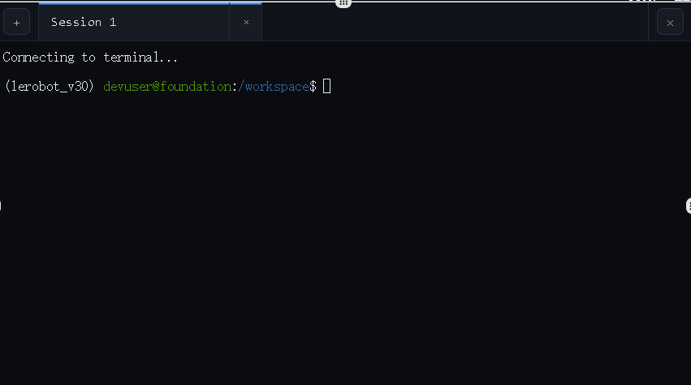

> ✅ **对照检查**：终端能正常输入命令即可。提示符带 `(lerobot_v30)` 前缀属正常现象，不影响运行。

### 2.3 进入脚本目录（截图 ②）

```
cd /workspace/smolvla_piper_towel/scripts
ls
```

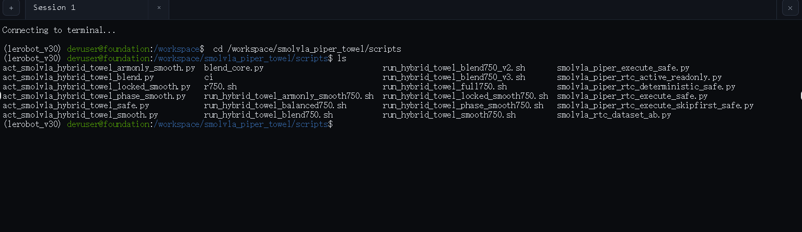

> ✅ **对照检查**：`ls` 输出里能看到 `run_hybrid_towel_blend750.sh`。看不到 = 目录不对，重新 `cd`。

### 2.4 打开三路相机，看真实画面（截图 ③ — **必做**）

> 🛑 **这一步是必做的，不能跳过**：三路画面确认了机械臂的"眼睛"（相机）正常，是后面一切验证的前提。**截到清晰的左 / 中 / 右三路画面，才继续往下。**

1. 打开卡片的**「画面 / 摄像头」面板**；
2. 选择 **左相机 / 中相机 / 右相机** 三路；
3. 确认三路画面正常：**左** = 抓取侧视角、**中** = 正对毛巾、**右** = 工作台全局。

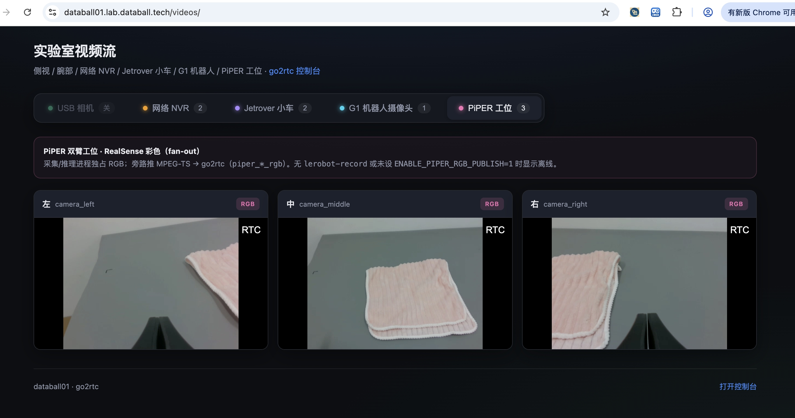

> ✅ **对照检查（必须全部满足）**：
> - 三路画面**都有图像**，不是黑屏 / 花屏；
> - 画面里能看到**毛巾台 + 机械臂**；
> - 能分清哪路是左、哪路是中、哪路是右。
>
> 任一条件不满足 = 相机没开对，先解决（见 4.4）再继续，**不要跳过**。
>
> 💡 **三路画面就是模型的"眼睛"**：SmolVLA 就是看着这三路画面做决策的。运行前先看画面，能确认毛巾位置、相机角度是否正常。
>
> ⚠️ **运行脚本前建议先关闭画面面板**：画面面板观看期间可能占用相机，若运行脚本时提示相机打不开，先关闭画面面板再重跑。

### 2.5 运行一键脚本（截图 ④）

在 `scripts` 目录下运行：

```bash
bash run_hybrid_towel_blend750.sh
```

敲下回车后，应立刻看到脚本横幅和**阶段一：双臂归位**，机械臂开始动作：

```
============================================================
双Piper毛巾折叠：SmolVLA 一键完整750步
...
===== 第一阶段：双臂归位 =====
```

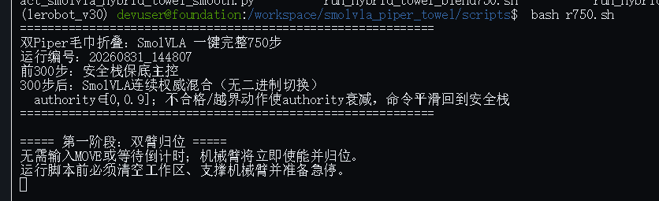

> ✅ **对照检查**：出现"第一阶段：双臂归位"且机械臂回起始位 = 阶段一成功。
>
> 🛑 **机械臂此时会动**：确认你已站到急停旁、台面已清空。

### 2.6 对照执行日志（截图 ⑤–⑨）

**⑤ 相机检测成功**

阶段二开始，脚本自动检测三路相机。**你已在 2.4 看到的三路画面（见 ③）就是相机检测通过的证据**；脚本同时会在终端打印三个编号：

```
相机：left=18 middle=12 right=4
```


> ✅ **对照检查**：三路画面都有图像（见 ③）、三个编号都有值 = 相机检测通过。出现 `left=` 等为空 = 相机被占用，按 4.3 处理。

**⑥ 模型加载完成**

接着加载 SmolVLA 权重。加载需数秒到十几秒（无 GPU，CPU 推理），**日志停住是正常的**，不要以为卡死。加载成功的标志是出现模型路径和 `Mode=EXECUTE`：

```
Loading SmolVLA candidate: /home/databall_02/VLA/experiments/smolvla_hq60_newonly_from50k_b8_5k_v2/checkpoints/005000/pretrained_model
Reducing the number of VLM layers to 16 ...
Loading weights from local directory
Mode=EXECUTE max_actions=750 handoff_step=300 max_authority=0.90
```

> ✅ **对照检查**：出现 `Loading SmolVLA candidate`、`Mode=EXECUTE`，且没有 `Error` / `ImportError` 字样 = 模型加载成功。有报错按 4.2 处理。
>
> 💡 中间的 `torch_dtype is deprecated` 只是警告，不影响运行。

**⑦ 前 300 步（安全基线保底）**

执行开始，前 300 步应看到 `source=SAFE`、`authority=0.00`：

```
step=0001 source=SAFE joint_step=0.01818 tracking=0.15758 queue=0 authority=0.00 corr=0.0000 primary
step=0002 source=SAFE joint_step=0.00795 tracking=0.17575 queue=0 authority=0.00 corr=0.0000 primary
...
```

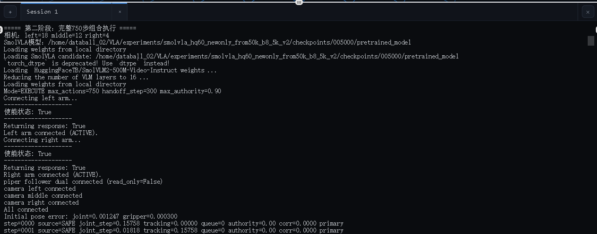

> ✅ **对照检查**：`source=SAFE`、`authority=0.00` 且步号递增 = 正常保底阶段，**不是故障**。

**⑧ 第 300 步切入 SmolVLA**

到第 300 步，应看到一行明显不同的日志——SmolVLA 混合模式切入：

```
HANDOFF_REQUEST step=300: SmolVLA blend mode enabled
step=0300 source=SAFE joint_step=0.05444 tracking=0.00709 queue=0 authority=0.00 corr=0.0000 queue empty; authority=0.00
...
step=0317 source=SmolVLA joint_step=0.00756 tracking=0.01042 queue=16 authority=0.14 corr=0.0024 authority=0.14 disagree=0.0361
```

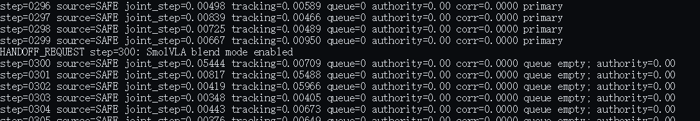

> ✅ **对照检查**：出现 `HANDOFF_REQUEST step=300` 且之后 `source=SmolVLA` = 混合切入成功。这是**本讲最重要的一个验证点**。

**⑨ 执行中段（SmolVLA 主导）**

随后 `authority` 应逐渐爬升并稳定在 0.7–0.9：

```
step=00508 source=SmolVLA joint_step=0.01568 tracking=0.05126 queue=30 authority=0.86 corr=0.1010 authority=0.86 disagree=0.1153
step=00509 source=SmolVLA joint_step=0.01418 tracking=0.04306 queue=29 authority=0.86 corr=0.1006 authority=0.86 disagree=0.1160
```

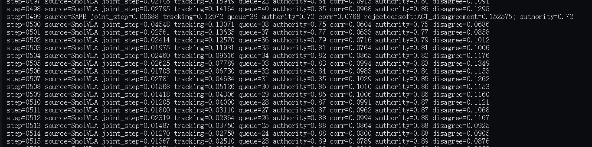

> ✅ **对照检查**：`source=SmolVLA` 为主、`authority` 稳定在 0.7 以上、`corr` 在 0.03–0.12 = SmolVLA 正在主导塑形。`authority` 长期接近 0 = 说明两模型分歧大，安全机制在保守工作（见 4.5）。

### 2.7 查看运行结果（截图 ⑩–⑫）

**⑩ 跑完看 status**

750 步走完后，脚本输出运行汇总。**顶部 `status=0` 是成功标志**：

```
run_id=20260828_...
status=0
safe_guard_ticks=NNN
smolvla_blend_actions=MMM
...
```

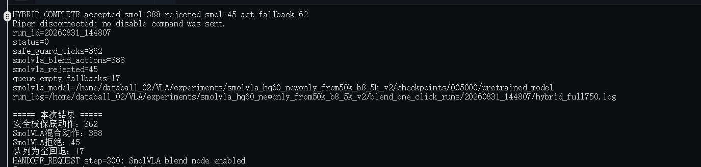

> ✅ **对照检查**：`status=0` = 完整 750 步成功，无安全停机。`status=1` = 中途出错，按第 4 节排查。

**⑪ 本次结果汇总**

末尾的 `===== 本次结果 =====` 块能看到本次 SmolVLA 参与情况：

```
===== 本次结果 =====
安全栈保底动作：NNN
SmolVLA混合动作：MMM     ← SmolVLA 实际参与的步数
SmolVLA拒绝：RRR
队列为空回退：EEE
```

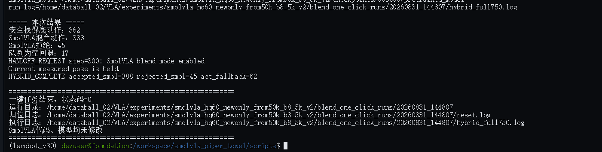

> ✅ **对照检查**：`SmolVLA混合动作` 数越多、`SmolVLA拒绝` 越少 = 塑形越顺畅。这是判断"这次跑得好不好"的核心指标。

**⑫ 运行产物**

每次运行的详细产物都在一个「运行编号」目录里。先定义目录变量（换机器只需改这一行）：

```bash
R=/home/databall_02/VLA/experiments/smolvla_hq60_newonly_from50k_b8_5k_v2
```

`latest` 指向最近一次运行，直接查看：

```bash
ls $R/blend_one_click_runs/latest/
```

应看到 `reset.log`（归位日志）、`hybrid_full750.log`（完整执行日志）、`summary.txt`（本次计数汇总）：

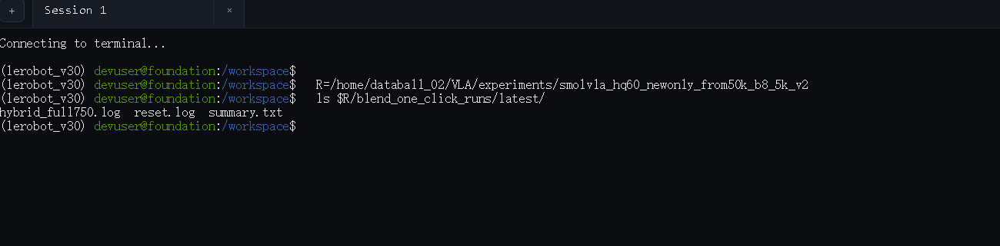

> ✅ **对照检查**：三个文件都存在 = 运行产物完整。`summary.txt` 里能看到本次运行的模型路径与各项计数。

---

<div style="page-break-after: always;"></div>

## 3. 定制你的任务

### 3.1 调 authority 与步数

运行脚本里的关键参数：

| 参数 | 当前值 | 含义 |
|------|--------|------|
| `--max-actions` | 750 | 总步数 |
| `--handoff-step` | 300 | 第几步切入混合模式 |
| `--max-authority` | 0.9 | SmolVLA 权重上限 |
| `--authority-up-rate` | 0.15 | 每接受步 authority 指数逼近上限 |
| `--authority-decay` | 0.85 | 软拒绝 / 空队列衰减 |
| `--authority-hard-decay` | 0.5 | 硬拒绝（越界）衰减 |
| `--smol-correction-limit` | 0.15 | SmolVLA 修正幅度上限（rad） |
| `--correction-step-limit` | 0.02 | 修正每步 slew 上限（rad/步） |

> 💡 **想多给 SmolVLA 一些主导权**：把 `--max-authority` 调到 0.95、`--smol-correction-limit` 调到 0.18。想更保守：把 `--max-authority` 调低、`--correction-step-limit` 调小。

### 3.2 切换模型权重

修改脚本里的 `--smol-model` 参数，指向 `/workspace/models/` 下的其他权重：

```bash
--smol-model /workspace/models/smolvla_stageA
--smol-model /workspace/models/smolvla_stageB_v2_mixed_unfreeze   # 推荐
```

> ⚠️ **不同权重表现差异大**：Stage A 是预训练权重，动作较粗；Stage B 微调过叠毛巾任务，才适合真机演示。

### 3.3 调整相机索引

脚本开头的相机编号指向 `/dev/videoN`。本机实测可用的组合是：

| 视角 | 设备 |
|------|------|
| 左 | video18 |
| 中 | video12 |
| 右 | video4 |

> ⚠️ **其他 video 节点是深度 / IR 节点，画面是黑白的，不可用作模型输入**。换机器后先 `ls /dev/video*` 确认再改。

---

<div style="page-break-after: always;"></div>

## 4. 常见问题排查

### 4.1 打开终端后报 conda activate 相关错误

**原因**：平台环境未初始化 conda，`conda activate` 会报错。

**处理**：不要执行 `conda activate`，直接跑一键脚本即可。环境（PYTHONPATH / 依赖路径）由运行脚本内部自动配置。

### 4.2 `status=1`，报 `cannot import name 'make_pre_post_processors'`

**原因**：终端丢了 PYTHONPATH，`import lerobot` 解析到了缺少该函数的库。

**处理**：

1. 确保用的是**一键脚本**（脚本内部已配置 PYTHONPATH），不要手动 `python` 调用；
2. 若改过脚本，检查第 11 行附近有 `source /workspace/pyshim/env.sh`。

### 4.3 模型加载报错 / 离线缓存错误

**原因**：卡片离线环境无法访问 Hugging Face。

**处理**：模型已预置在 `/workspace/models/`，走一键脚本即可自动重定向；**不要尝试下载**。

### 4.4 相机打不开 / 无画面

**原因**：相机被画面面板或其他程序占用。

**处理**：先关闭画面面板，确认无其他进程占用相机后重跑。运行期间提示 `相机：...` 且三个编号都正确才算通过。

### 4.5 手臂归位后不动

**原因**：主脚本异常退出（见上方报错）。

**处理**：查看终端报错对照排查。异常时手臂**保持当前姿态，不会失能下坠**——确认急停可用后，再重新运行。

### 4.6 中途安全停机

**原因**：某步命令越界或与基线分歧过大，安全系统正确介入。

**处理**：检查日志里 `joint_step` / `tracking` 是否超限、`authority` 是否被压到接近 0。这是**安全机制在工作**，不是故障。

---

## 5. 知识小结

完成本讲后，你应该能回答：

1. **SmolVLA 由哪两部分构成？**
   → 视觉语言骨干（SmolVLM2-500M）+ 动作专家头（Action Expert）。骨干看图像和指令，动作头解码出关节动作。

2. **为什么用动作分块？**
   → 一次预测未来 50 步的动作块，减少逐帧累积误差，动作更平滑。

3. **`authority` 是什么？怎么变？**
   → SmolVLA 在安全基线上叠加修正的连续权重 ∈ [0, 0.9]。两模型一致时上升，分歧时按 0.85 / 0.5 衰减。

4. **为什么 SmolVLA 不会让机械臂失控？**
   → 修正有幅度上限（0.15 rad）和每步 slew 上限（0.02 rad），夹爪恒为基线所有，越界时 authority 自动塌缩回安全基线。

5. **前 300 步 `source=SAFE`、`authority=0` 正常吗？**
   → 正常。混合模式在第 300 步才切入，前面是安全基线保底阶段。

6. **怎么判断一次运行成功了？**
   → 看到 `status=0`、出现 `HANDOFF_REQUEST step=300`、`source=SmolVLA` 且 `authority` 稳定在 0.7 以上。

---

## 6. 延伸阅读与课程总结

**命令速查：**

| 操作 | 命令 |
|------|------|
| 进入脚本目录 | `cd /workspace/smolvla_piper_towel/scripts` |
| 一键运行 | `bash run_hybrid_towel_blend750.sh` |
| 查看相机设备 | `ls /dev/video*` |
| 查看结果目录 | `ls $R/blend_one_click_runs/latest/`（R 的定义见 2.7 ⑫） |

**延伸：**

- 想深入模型原理，可读仓库 `src/lerobot/policies/smolvla/` 下的 `modeling_smolvla.py`、`processor_smolvla.py`
- 想理解塑形控制器数学，可读 `scripts/blend_core.py`（纯数学模块，可离线测试）
- 想了解 RTC 异步推理管线，可读 `src/lerobot/async_inference/`（policy server + robot client）

---

## 课程总结

回顾你走过的路：

| 环节 | 核心能力 |
|------|----------|
| 概念 | 知道 VLA = 视觉语言模型 + 动作专家 |
| 原理 | 看懂动作分块、两阶段训练、authority 塑形 |
| 实操 | 打开三路相机 → 一键跑通 750 步真机叠毛巾 |
| 进阶 | 会读日志、会调参数、会排查 |

从"看画面"到"看日志"再到"跑通真机"，你已经完整走了一遍 **视觉语言动作模型（VLA）的真机部署链路**。后续可以尝试：

- **调大 `max-authority`**，感受 SmolVLA 主导力更强的表现；
- **切换不同 Stage 权重**，对比预训练与微调的动作质量差异；
- **用 Rerun / 回放工具**复盘一次完整运行，观察 authority 与修正量的时序变化。

祝你在数聚球平台玩得开心！

---

*SmolVLA 叠毛巾教案 · 数聚球平台*
